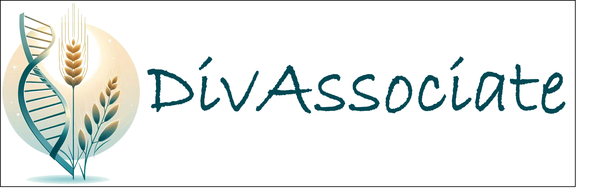

DivAssociate is a workflow implemented in Nextflow to perform a GWAS using GEMMA's [1] Linear Mixed Model algorithm. It uses genotyping data in VCF format and phenotyping data in a CSV file.

# Worfklow visualization

# Worfklow visualization

```mermaid
%%{init: {"flowchart": {"defaultRenderer": "elk"}} }%%
flowchart LR
    subgraph PREPARE_INPUTS
    direction LR
    subgraph take1[take]
    vcf
    samples
    phenotypes
    covariates
    end
    extract_prefix([extract_prefix])
    slice_vcf([slice_vcf])
    transform_vcf([transform_vcf])
    correct_phenotypes([correct_phenotypes])
    transform_phenotypes([transform_phenotypes])
    combine_with_pheno([combine_with_pheno])

    subgraph emit1[emit]
    bim
    bed
    fam
    end

    vcf-->slice_vcf
    vcf-->extract_prefix-->transform_vcf
    samples-->slice_vcf
    slice_vcf-->transform_vcf-->bim
    transform_vcf-->bed
    transform_vcf-->combine_with_pheno
    phenotypes-->correct_phenotypes
    covariates-->correct_phenotypes-->transform_phenotypes-->combine_with_pheno
    combine_with_pheno-->fam
    end

    subgraph PERFORM_ASSOCIATION_STUDY
    direction LR
    subgraph take2[take]
    bed2[bed]
    bim2[bim]
    fam2[fam]
    end

    compute_relatedness_matrix([compute_relatedness_matrix])
    perform_association_test([perform_association_test])
    
    subgraph emit2[emit]
    assoc1[assoc]
    end

    bed2-->compute_relatedness_matrix
    bim2-->compute_relatedness_matrix
    fam2-->compute_relatedness_matrix

    
    bed2-->perform_association_test
    bim2-->perform_association_test
    fam2-->perform_association_test

    compute_relatedness_matrix-->perform_association_test-->assoc1

    end

    subgraph PREPARE_OUTPUTS
    direction LR
    subgraph take3[take]
    assoc2[assoc]
    end
    plot_overview([plot_overview])
    split_chromosome([split_chromosome])
    plot_chromosome_overview([plot_chromosome_overview])

    assoc2-->plot_overview
    assoc2-->split_chromosome-->plot_chromosome_overview
    end
    bed-->bed2
    bim-->bim2
    fam-->fam2
    assoc1-->assoc2
```

# Citations

[1] Zhou, X., Stephens, M. Genome-wide efficient mixed-model analysis for association studies. Nat Genet 44, 821–824 (2012). https://doi.org/10.1038/ng.2310

[2] Li H. A statistical framework for SNP calling, mutation discovery, association mapping and population genetical parameter estimation from sequencing data. Bioinformatics. 2011 Nov 1;27(21):2987-93. doi: 10.1093/bioinformatics/btr509. Epub 2011 Sep 8. PMID: 21903627; PMCID: PMC3198575.

[3] Purcell, S., Neale, B., Todd-Brown, K., Thomas, L., Ferreira, M. A., Bender, D., ... & Sham, P. C. (2007). PLINK: a tool set for whole-genome association and population-based linkage analyses. The American journal of human genetics, 81(3), 559-575.

[4] Felipe da Veiga Leprevost, Björn A Grüning, Saulo Alves Aflitos, Hannes L Röst, Julian Uszkoreit, Harald Barsnes, Marc Vaudel, Pablo Moreno, Laurent Gatto, Jonas Weber, Mingze Bai, Rafael C Jimenez, Timo Sachsenberg, Julianus Pfeuffer, Roberto Vera Alvarez, Johannes Griss, Alexey I Nesvizhskii, Yasset Perez-Riverol, BioContainers: an open-source and community-driven framework for software standardization, Bioinformatics, Volume 33, Issue 16, August 2017, Pages 2580–2582, https://doi.org/10.1093/bioinformatics/btx192