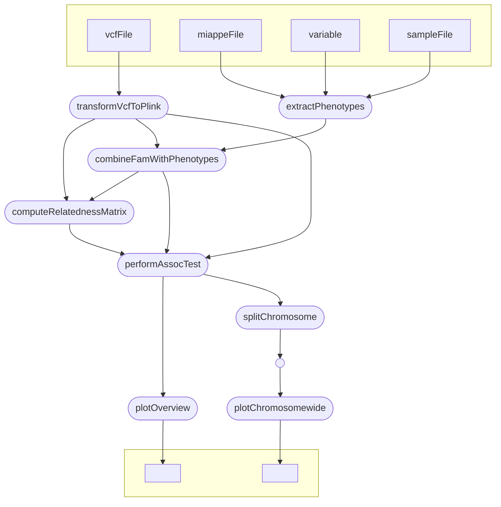

# DivAssociate

DivAssociate is a workflow implemented in Nextflow to perform a GWAS using GEMMA's [1] Linear Mixed Model algorithm. It uses genotyping data in VCF format and phenotyping data in ISA Tab format compliant to the MIAPPE [2] data model.

# Citations

[1] Zhou, X., Stephens, M. Genome-wide efficient mixed-model analysis for association studies. Nat Genet 44, 821–824 (2012). https://doi.org/10.1038/ng.2310

[2] Papoutsoglou, E.A., Faria, D., Arend, D., Arnaud, E., Athanasiadis, I.N., Chaves, I., Coppens, F., Cornut, G., Costa, B.V., Ćwiek-Kupczyńska, H., Droesbeke, B., Finkers, R., Gruden, K., Junker, A., King, G.J., Krajewski, P., Lange, M., Laporte, M.-A., Michotey, C., Oppermann, M., Ostler, R., Poorter, H., Ramı́rez-Gonzalez, R., Ramšak, Ž., Reif, J.C., Rocca-Serra, P., Sansone, S.-A., Scholz, U., Tardieu, F., Uauy, C., Usadel, B., Visser, R.G.F., Weise, S., Kersey, P.J., Miguel, C.M., Adam-Blondon, A.-F. and Pommier, C. (2020), Enabling reusability of plant phenomic datasets with MIAPPE 1.1. New Phytol, 227: 260-273. https://doi.org/10.1111/nph.16544 

[3] Li H. A statistical framework for SNP calling, mutation discovery, association mapping and population genetical parameter estimation from sequencing data. Bioinformatics. 2011 Nov 1;27(21):2987-93. doi: 10.1093/bioinformatics/btr509. Epub 2011 Sep 8. PMID: 21903627; PMCID: PMC3198575.

[4] Purcell, S., Neale, B., Todd-Brown, K., Thomas, L., Ferreira, M. A., Bender, D., ... & Sham, P. C. (2007). PLINK: a tool set for whole-genome association and population-based linkage analyses. The American journal of human genetics, 81(3), 559-575.

[5] Felipe da Veiga Leprevost, Björn A Grüning, Saulo Alves Aflitos, Hannes L Röst, Julian Uszkoreit, Harald Barsnes, Marc Vaudel, Pablo Moreno, Laurent Gatto, Jonas Weber, Mingze Bai, Rafael C Jimenez, Timo Sachsenberg, Julianus Pfeuffer, Roberto Vera Alvarez, Johannes Griss, Alexey I Nesvizhskii, Yasset Perez-Riverol, BioContainers: an open-source and community-driven framework for software standardization, Bioinformatics, Volume 33, Issue 16, August 2017, Pages 2580–2582, https://doi.org/10.1093/bioinformatics/btx192